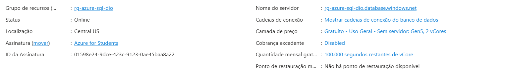
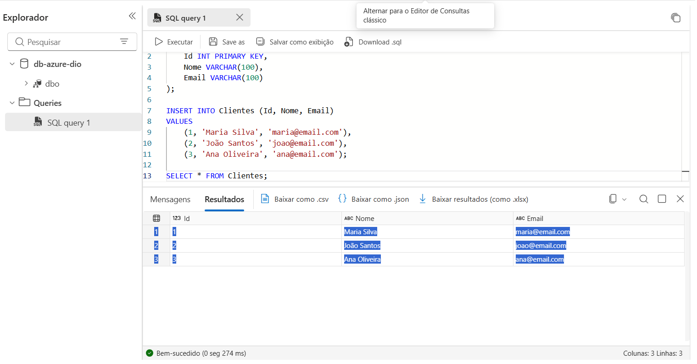

# 🗄️ Laboratório Azure SQL Database — DIO

## 📌 Sobre o projeto

Este projeto foi desenvolvido como parte de um laboratório da **Digital Innovation One (DIO)**, com o objetivo de praticar a criação, configuração e utilização de um banco de dados SQL na plataforma **Microsoft Azure**.

Durante o laboratório, foi criado um **Azure SQL Database**, configurada a infraestrutura, aplicadas configurações de rede e segurança, utilizada a oferta gratuita do Azure e executados comandos SQL diretamente pelo portal.

---

## 🎯 Objetivos

* Criar um banco de dados SQL no Microsoft Azure;
* Configurar um Resource Group e um servidor SQL;
* Configurar computação e armazenamento;
* Utilizar a oferta gratuita do Azure SQL Database;
* Configurar opções de rede e segurança;
* Executar comandos SQL no banco de dados;
* Documentar o processo e os principais aprendizados.

---

## ☁️ Ambiente utilizado

| Configuração       | Valor                                   |
| ------------------ | --------------------------------------- |
| Plataforma         | Microsoft Azure                         |
| Serviço            | Azure SQL Database                      |
| Assinatura         | Azure for Students                      |
| Resource Group     | `rg-azure-sql-dio`                      |
| Região             | Central US                              |
| Banco de dados     | `db-azure-dio`                          |
| Servidor           | `rg-azure-sql-dio.database.windows.net` |
| Camada             | Gratuito - Uso Geral - Sem servidor     |
| Série              | Standard Gen5                           |
| vCores             | 2                                       |
| Armazenamento      | 32 GB                                   |
| Backup             | Redundância local                       |
| Cobrança excedente | Desabilitada                            |
| TLS mínimo         | 1.2                                     |

---

## 🏗️ Etapas realizadas

### 1. Criação do Resource Group

Foi criado um novo grupo de recursos para organizar os recursos utilizados neste laboratório:

```text
rg-azure-sql-dio
```

---

### 2. Criação do Azure SQL Database

Foi criado o banco de dados:

```text
db-azure-dio
```

O servidor SQL foi criado na região **Central US**.

O método de autenticação configurado foi:

```text
Autenticação somente do Microsoft Entra
```

---

### 3. Configuração de computação e armazenamento

Foi utilizada a opção:

```text
Uso Geral - Sem servidor
```

Configuração:

* Standard Gen5;
* 2 vCores;
* 32 GB de armazenamento;
* Zona redundante desabilitada.

A oferta gratuita do Azure foi aplicada à configuração.

A assinatura apresentou:

* 100.000 segundos de vCore gratuitos por mês;
* 32 GB de armazenamento gratuito;
* 32 GB de armazenamento de backup gratuito.

A cobrança excedente foi desabilitada para evitar cobranças além dos limites da oferta gratuita.

---

### 4. Configuração de rede

Foram utilizadas as seguintes configurações:

* Ponto de extremidade público;
* Acesso de serviços e recursos do Azure ao servidor: desabilitado;
* Endereço IP do cliente atual: adicionado;
* Ponto de extremidade privado: nenhum;
* TLS mínimo: 1.2;
* Política de conexão: padrão.

---

### 5. Configuração de segurança

Foram mantidas as configurações adequadas ao laboratório:

* Transparent Data Encryption com chave gerenciada pelo serviço;
* Microsoft Defender for SQL: não habilitado;
* Identidade do servidor: não habilitada;
* Chave gerenciada pelo cliente: não configurada;
* Always Encrypted: não configurado;
* SQL Ledger: desabilitado.

---

## 💻 Teste de conexão e execução de SQL

Após a criação do banco, foi utilizado o editor de consultas SQL disponibilizado pelo Azure Portal.

### Teste inicial

Foi executado o comando:

```sql
SELECT 1 AS Teste;
```

O resultado retornado foi:

```text
Teste
1
```

Esse teste confirmou que era possível executar comandos SQL no banco de dados.

---

## 🗃️ Criação e consulta de uma tabela

Para realizar uma atividade prática no banco, foi criada uma tabela simples de clientes:

```sql
CREATE TABLE Clientes (
    Id INT PRIMARY KEY,
    Nome VARCHAR(100),
    Email VARCHAR(100)
);
```

Em seguida, foram inseridos três registros:

```sql
INSERT INTO Clientes (Id, Nome, Email)
VALUES
    (1, 'Maria Silva', 'maria@email.com'),
    (2, 'João Santos', 'joao@email.com'),
    (3, 'Ana Oliveira', 'ana@email.com');
```

Por fim, foi realizada uma consulta para verificar os dados:

```sql
SELECT * FROM Clientes;
```

### Resultado

| Id | Nome         | Email                                     |
| -: | ------------ | ----------------------------------------- |
|  1 | Maria Silva  | [maria@email.com](mailto:maria@email.com) |
|  2 | João Santos  | [joao@email.com](mailto:joao@email.com)   |
|  3 | Ana Oliveira | [ana@email.com](mailto:ana@email.com)     |

---

## 📸 Evidências

### Banco de dados criado



### Execução de consulta SQL



---

## 📚 Aprendizados

Durante este laboratório, foi possível praticar:

* Criação e organização de recursos no Microsoft Azure;
* Configuração de um Azure SQL Database;
* Conceitos de banco de dados SQL em ambiente de nuvem;
* Configuração de computação Serverless;
* Utilização de uma oferta gratuita do Azure;
* Configurações básicas de rede e segurança;
* Execução de comandos SQL;
* Criação de tabelas;
* Inserção de registros;
* Consulta de dados utilizando `SELECT`;
* Documentação técnica de um projeto.

---

## 💡 Considerações finais

O laboratório permitiu colocar em prática conceitos de banco de dados e computação em nuvem utilizando o Microsoft Azure.

Além da criação do banco de dados, a execução de comandos SQL possibilitou validar o funcionamento da instância e compreender melhor o processo de utilização de um banco de dados SQL em um ambiente de nuvem.

---

## 🔗 Referências

* Microsoft Azure — Azure SQL Database
* Microsoft Learn — documentação oficial do Azure SQL
* Digital Innovation One (DIO) — laboratório de criação de banco de dados SQL
